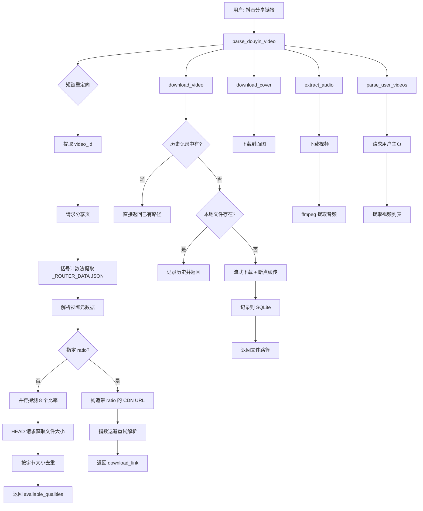

# Douyin Video MCP Server

抖音视频去水印解析 MCP Server，供 Claude Code CLI 或其他 AI Agent 使用。

## 为什么用 MCP

MCP 提供结构化工具定义，让 AI Agent 精准理解每个工具的用途、参数和返回值。相比 CLI 脚本或 HTTP API，MCP 工具具有类型化参数、结构化返回值、进程内缓存和历史记录等优势，且任何支持 MCP 的 Agent 都可复用。

## 功能

| 工具 | 参数 | 说明 |
|------|------|------|
| `parse_douyin_video` | `share_url, ratio?` | 解析抖音链接，返回视频元数据 + 无水印 CDN 链接 |
| `parse_batch` | `share_urls, ratio?` | 批量解析，内部并行执行 |
| `download_video` | `share_url, filename?, save_dir?, ratio?` | 解析 + 下载，自动记录历史并去重 |
| `download_batch` | `share_urls, save_dir?, ratio?` | 批量下载，内部并行执行 |
| `download_cover` | `share_url, save_dir?, filename?` | 下载视频封面图 |
| `extract_audio` | `share_url, save_dir?, filename?, ratio?` | 提取音频为 MP3（需 ffmpeg） |
| `parse_user_videos` | `user_url, max_count?` | 获取用户主页视频列表（最多 50 个） |
| `list_download_history` | `limit?, file_type?, keyword?` | 查询下载历史（按类型/关键词筛选） |

### ratio 参数

| 值 | 说明 |
|----|------|
| `None`（默认） | 自动探测所有可用清晰度，返回 `available_qualities` 列表 |
| `"720p"` / `"540p"` 等 | 指定转码版本 |
| `"original"` | 原始画质（未转码，文件最大） |

## 架构

```
douyin-mcp-server/
├── server.py              # MCP 工具定义（FastMCP, stdio 传输）
├── douyin_parser.py       # 核心解析逻辑（清晰度探测、CDN 解析、下载）
├── history.py             # SQLite 下载历史记录
├── constants.py           # 请求头、超时、重试常量
├── reload_wrapper.py      # 自动重载包装器（watchdog 监听 .py 变化）
├── requirements.txt       # 生产依赖
├── requirements-dev.txt   # 开发依赖（含 watchdog）
└── videos/                # 下载目录 + history.db
```

### 数据流



### 关键设计

- **自适应清晰度**：并行探测 8 个比率（240p~4k），按文件大小精确去重
- **TTL 缓存**：`cachetools.TTLCache`（30 分钟过期），避免 CDN 链接失效
- **断点续传**：下载支持 `Range` 请求头，网络中断后可继续
- **路径安全**：`_sanitize_filename` + `os.path.basename` + `os.path.realpath` 三重防护
- **Session 复用**：模块级 `requests.Session()` 复用 TCP 连接
- **指数退避**：CDN 解析重试使用 `0.5 * 2^i` 秒退避，429 状态码额外等待

## 安装

```bash
cd D:\Tools\AI\Claude-code\douyin-mcp-server
pip install -r requirements.txt
```

开发环境（含自动重载）：

```bash
pip install -r requirements-dev.txt
```

## 配置 Claude Code

```bash
claude mcp add --transport stdio --scope user douyin-video -- python D:\Tools\AI\Claude-code\douyin-mcp-server\reload_wrapper.py
```

## 自动重载

通过 `reload_wrapper.py` + `watchdog` 监听 `.py` 文件变化，代码修改后 MCP 进程自动重启。

- 修改已有工具的代码逻辑 → 自动生效
- **新增工具 → 需要重启 Claude Code 会话**（MCP 客户端在启动时缓存工具列表）

## 依赖

| 包 | 用途 |
|----|------|
| `mcp[cli]>=1.2.0` | MCP 协议 |
| `requests>=2.28.0` | HTTP 请求 |
| `cachetools>=5.0.0` | TTL 缓存 |
| `watchdog>=3.0.0` | 文件监听（仅开发） |

可选：`ffmpeg`（音频提取功能需要）

## 项目来源

从 [flask_watermark_mvc](../flask_watermark_mvc) 重构而来，去除了 Flask/MySQL 依赖，保留核心解析逻辑。

## 待评估功能

| 功能 | 说明 | 难度 |
|------|------|------|
| 视频评论抓取 | 获取热门评论内容 | 中 |
| 视频搜索 | 按关键词搜索（需登录态） | 高 |
| 直播流录制 | 抓取直播间 m3u8 流 | 高 |
| 字幕提取 | 提取自动字幕（如有） | 中 |
